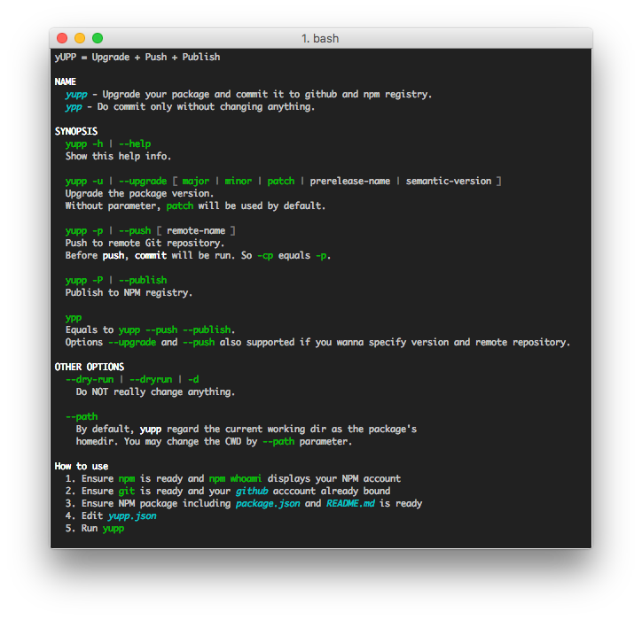

#	yupp
__Make NPM package upgrading easier.__

[](https://www.npmjs.com/package/yuan-npm-release)
[](https://www.npmjs.com/package/yuan-npm-release)
[](https://www.npmjs.com/package/yuan-npm-release)
[](https://coveralls.io/github/YounGoat/nodejs.npm-release2?branch=master)
[](https://travis-ci.org/YounGoat/nodejs.npm-release)
[](https://github.com/YounGoat/nodejs.npm-release/stargazers)

*yupp* is acronym of Yuan Upgrade, Push and Publish. It is also named as *yuan-npm-release*.

Are you tired with commit, push and publish? When you wanna upgrade your NPM package, this tool will help you finishing all works necessary with only one command.

##	Get Started

```bash
# Install yupp.
npm install -g yupp

# Display help info.
yupp -h

# Change directory to your package's root dir.
cd <path/to/package>

# Show what yupp will do.
# However, NO CHANGES made in fact.
yupp --dry-run

# Upgrade your NPM package with yupp.
yupp
```

##	What "upgrade" means?

At first, _upgrade_ means nothing but changing the package's version. Now, *yupp* will do the following things on package files:

*	Change the "version" field value of _package.json_.
*	Insert badges into _README.md_ if demanded.
*	Insert category into _README.md_ if it has not created.

##	Command Manual



##	yupp.json

*yupp.json* or *.yupp.json* is used to store meta info which is not supported by *package.json* and will be used by *yupp*, e.g. package alias. It should be like this:
```javascript
{
	"name": "yuan-npm-release",
	"alias": ["yupp"],
	"badges": [
		"npm.*",
		"github.*"
	]
}
```

*yupp.json* is not necessary, but it should conform to JSON schema [yupp.schema](./yupp.schema.json).

If __alais__ set, *yupp* will try to publish a renamed copy to NPM registry.
